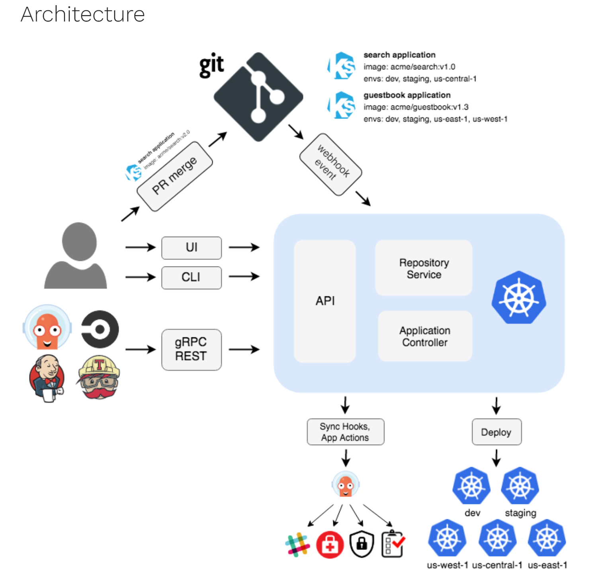

# Proof of Concept

## ArgoCD

<p>Argo CD is implemented as a Kubernetes controller which continuously monitors running applications and compares the current, live state against the desired target state (as specified in the Git repo). A deployed application whose live state deviates from the target state is considered OutOfSync. Argo CD reports & visualizes the differences, while providing facilities to automatically or manually sync the live state back to the desired target state. Any modifications made to the desired target state in the Git repo can be automatically applied and reflected in the specified target environments.</p>

1. Create cluster for ArgoCD:
```bash
$ k3d cluster create argo
...
INFO[0038] Cluster 'argo' created successfully!      
INFO[0038] You can now use it like this: kubectl cluster-info

$ kubectl cluster-info
Kubernetes control plane is running at https://0.0.0.0:42333
CoreDNS is running at https://0.0.0.0:42333/api/v1/namespaces/kube-system/services/kube-dns:dns/proxy
Metrics-server is running at https://0.0.0.0:42333/api/v1/namespaces/kube-system/services/https:metrics-server:https/proxy

# check all resources
$ kubectl get all -A
```
2. Follow instructions from [ArgoCD](https://argo-cd.readthedocs.io/en/stable/getting_started) website:
```bash
# create argocd namespace
$ kubectl create namespace argocd
namespace/argocd created

# get ArgoCD
$ kubectl apply -n argocd -f https://raw.githubusercontent.com/argoproj/argo-cd/stable/manifests/install.yaml

$ kubectl get all -n argocd

# check ArgoCD containers
$ k get pod -n argocd -w

NAME                                                READY   STATUS    RESTARTS   AGE
argocd-application-controller-0                     1/1     Running   0          50s
argocd-applicationset-controller-86c8767989-fn2gn   1/1     Running   0          51s
argocd-dex-server-55c6d584b5-l9rvb                  1/1     Running   0          51s
argocd-notifications-controller-74965f8dc9-ktf4m    1/1     Running   0          51s
argocd-redis-5dcbd87d95-rhh9r                       1/1     Running   0          51s
argocd-repo-server-5b76df5967-lsz58                 1/1     Running   0          51s
argocd-server-77f69c9d6-x7pxt                       1/1     Running   0          50s
```
3. Forward ArgoCD port:
```bash
$ kubectl port-forward svc/argocd-server -n argocd 8080:443
```
4. The web interface is now accessible on https://localhost:8080. The initial password for the admin account is auto-generated and stored as clear text in the field password in a secret named `argocd-initial-admin-secret` in your Argo CD installation namespace:
```bash
$ kubectl -n argocd get secret argocd-initial-admin-secret -o jsonpath="{.data.password}"|base64 -d;echo
pVHY37xZIGxCyLK5
```
5. Log in to ArgoCD and create new application:
- Click `+ NEW APP`<br>
*General section*:
- Application Name: `demo`
- Project Name: `default`
- SYNC POLICY: `Manual`

*Source section*:
- Repository URL: `link to project repository`
- Source type: `GIT`
- Path: `helm`

*Destination section*
- Cluster URL: `local cluster url`
- Namespace: `demo`
- Other parameters will be pulled from repository

- Check `AUTO-CREATE NAMESPACE` option
- Click `CREATE`
6. The application tile will appear on dashboard. Click on application tile and sync:

